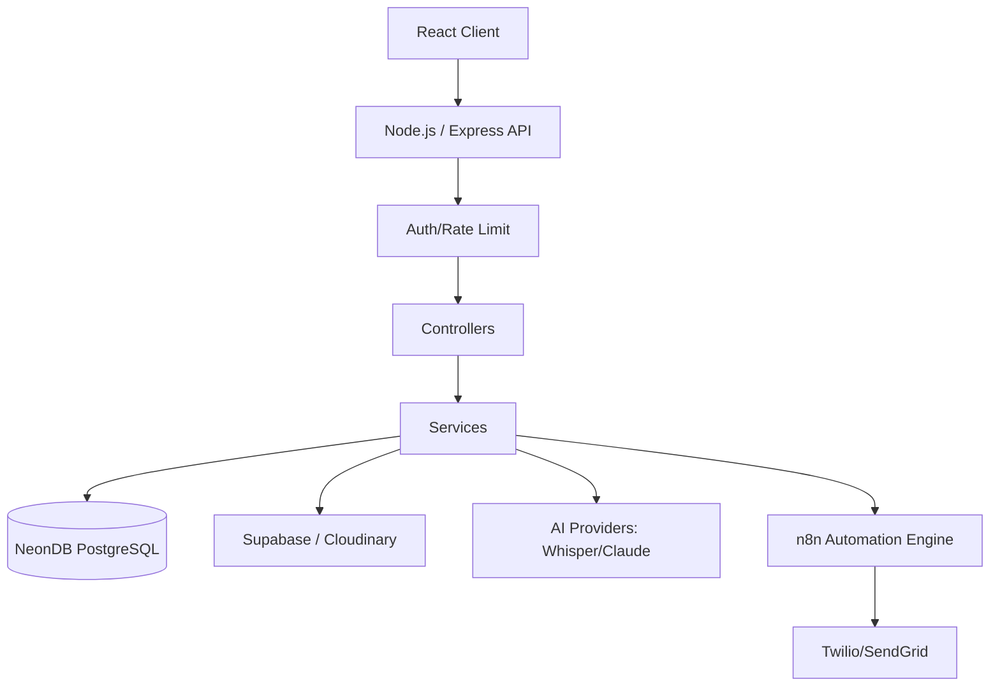
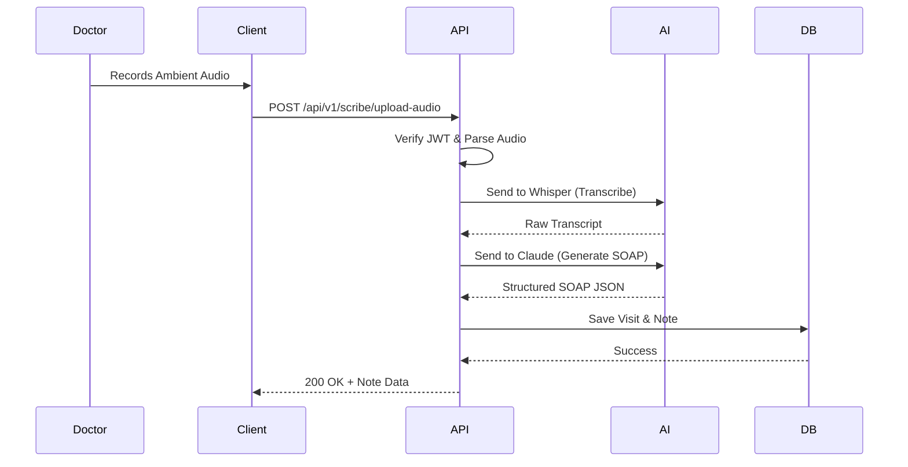
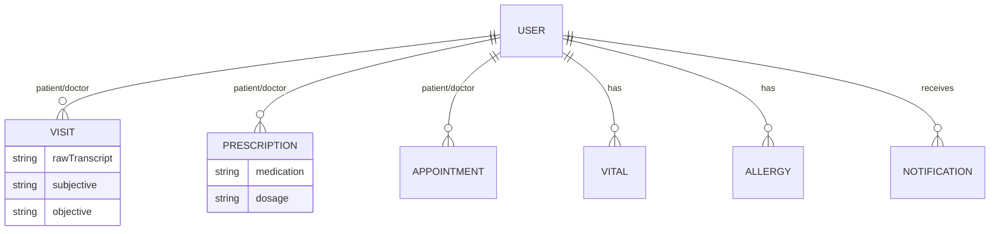
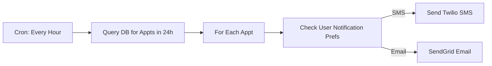
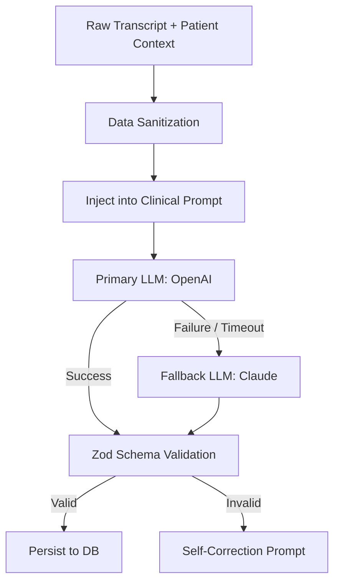

# 📊 Architecture Diagrams

## 1. System Architecture Diagram

## 2. Request Lifecycle Diagram (AI Scribe)

## 3. Entity Relationship Diagram (ERD) Overview

## 4. n8n Workflow Flowchart (Appointment Reminder)

## 5. AI Processing Flow

