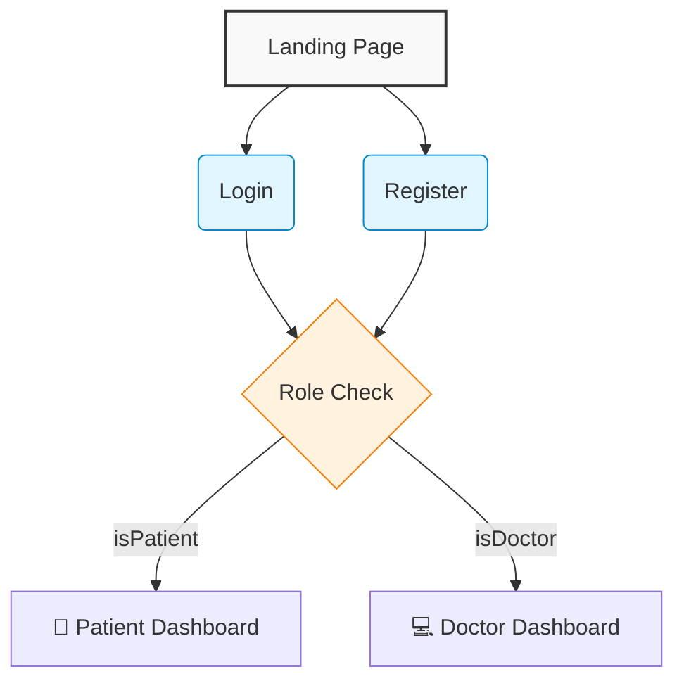
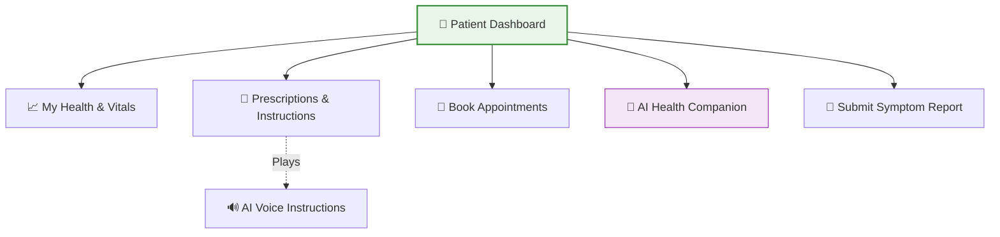
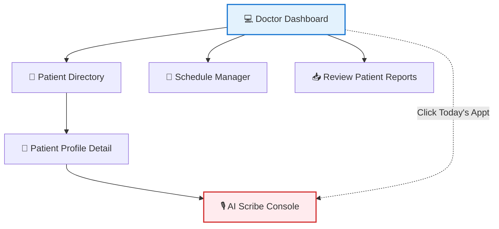
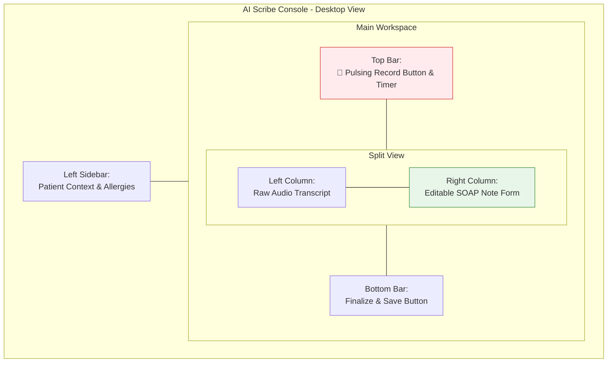

# 🎨 CareSync UI/UX Design & Page Flow Guide

This document is specifically created for the UI/UX Designer. It outlines every page that needs to be designed, what elements should be on each page, and the expected user flow (how users navigate from one screen to the next).

The application has **three distinct experiences** based on the user's role: **Guest (Public)**, **Patient**, and **Doctor**.

---

## 1️⃣ Public & Authentication Flow

**Target Device:** Mobile, Tablet, Desktop (Fully Responsive)

### 1. Landing Page (Home)

- **Purpose:** Marketing the product, explaining the AI Scribe and Patient Care features.
- **Key Elements:** Hero section, feature highlights, testimonials, clear Call-To-Action (CTA) buttons.
- **Next Step:** Clicking "Login" goes to the Login Page. Clicking "Get Started" goes to Register.

### 2. Login Page

- **Purpose:** Secure entry point into the app.
- **Key Elements:** Email input, Password input, "Forgot Password" link, "Login" button.
- **Next Step:** Upon successful login, the system detects the role and redirects -> Patient goes to `Patient Dashboard`, Doctor goes to `Doctor Dashboard`.

### 3. Registration / Sign Up

- **Purpose:** Account creation.
- **Key Elements:** Name, Email, Password, Role Toggle (I am a Patient / I am a Doctor), Date of Birth.
- **Next Step:** Completing registration logs the user in and redirects to their respective dashboard.

---

## 2️⃣ The Patient Experience (Patient App)

**Target Device:** Mobile-First (Patients will primarily use their phones).

### 4. Patient Dashboard (Home)

- **Purpose:** The central hub summarizing the patient's current health status.
- **Key Elements:**
  - Greeting ("Good morning, John").
  - "Next Appointment" widget with countdown.
  - "Action Required" alerts (e.g., "Time to take your medication").
  - Quick action buttons (Book Appointment, Chat with AI).
- **Next Step:** Navigation to any of the specific sections below.

### 5. My Health & Vitals

- **Purpose:** Tracking health metrics over time.
- **Key Elements:**
  - Visual charts/graphs showing Heart Rate, Blood Pressure, and Weight over months.
  - "Add New Reading" modal/drawer to input today's vitals.
- **Next Step:** Submitting a reading updates the graph instantly.

### 6. Prescriptions & Care Instructions

- **Purpose:** Helping the patient understand their medications.
- **Key Elements:**
  - List of active medications with dosages (e.g., "1 Pill - Morning").
  - **AI Feature:** A "Simplified Instructions" card written in plain English.
  - **AI Feature:** A "Play Voice Instructions" button to hear the instructions out loud.

### 7. Appointments & Booking

- **Purpose:** Managing doctor visits.
- **Key Elements:**
  - List of past and upcoming visits.
  - "Book New Appointment" flow: Select a doctor -> Select a date -> Select a time slot -> Confirm.

### 8. AI Health Companion (Chat)

- **Purpose:** A conversational interface for health queries.
- **Key Elements:**
  - Standard chat interface (like ChatGPT or iMessage).
  - Text input bar and "Send" button.
  - AI messages should look visually distinct from the patient's messages.

### 9. Submit Health Update (Patient Report)

- **Purpose:** Informing the doctor about symptoms between visits.
- **Key Elements:**
  - Form: Select Doctor, Describe Symptoms, Select Severity (Mild/Moderate/Severe).
  - Submit button.

---

## 3️⃣ The Provider Experience (Doctor Portal)

**Target Device:** Tablet & Desktop-First (Doctors will use iPads or laptops in the clinic).

### 10. Doctor Dashboard (Home)

- **Purpose:** The doctor's daily command center.
- **Key Elements:**
  - Today's Schedule / Appointment timeline.
  - "Pending Reviews" widget (Patient reports or abnormal vitals that need attention).
- **Next Step:** Clicking an appointment opens the **AI Scribe Console**.

### 11. Patient Directory

- **Purpose:** A CRM-style list of all patients assigned to the doctor.
- **Key Elements:** Search bar, filter by condition, table/list showing Patient Name, Age, Last Visit Date.
- **Next Step:** Clicking a row opens the **Patient Profile Detail**.

### 12. Patient Profile Detail

- **Purpose:** Deep dive into a single patient's medical history.
- **Key Elements:**
  - Patient demographics (Age, Blood Type, Allergies).
  - List of past visits / SOAP notes.
  - Current active prescriptions.
  - Vitals history.
- **Next Step:** "Start Visit" button -> Redirects to the AI Scribe Console.

### 13. 🌟 AI Scribe Console (The Core Feature)

- **Purpose:** Recording the conversation and generating the automated clinical note. This is the most important screen in the app.

**UI Layout Visualization:**

- **Key Elements:**
  - **Left Sidebar/Top Bar:** Brief patient context (Name, age, allergies).
  - **Recording Area:** Large, prominent "Record Session" button. A pulsing visualizer animation while recording. A "Stop & Process" button.
  - **Split View Output:**
    - Left Column: Raw transcript of the conversation.
    - Right Column: Editable form fields for the AI-generated **SOAP Note** (Subjective, Objective, Assessment, Plan) and Prescriptions list.
  - **Action:** "Finalize & Save" button at the bottom.

### 14. Calendar & Scheduling Manager

- **Purpose:** Managing doctor availability.
- **Key Elements:** Full month/week calendar view. Ability to block out times or accept/reject pending appointment requests.

### 15. Reports Review / Care Coordination

- **Purpose:** Reviewing symptom updates sent by patients.
- **Key Elements:** Inbox-style list of patient reports. When clicked, it expands to show the patient's message. Includes a "Mark as Reviewed" button.
