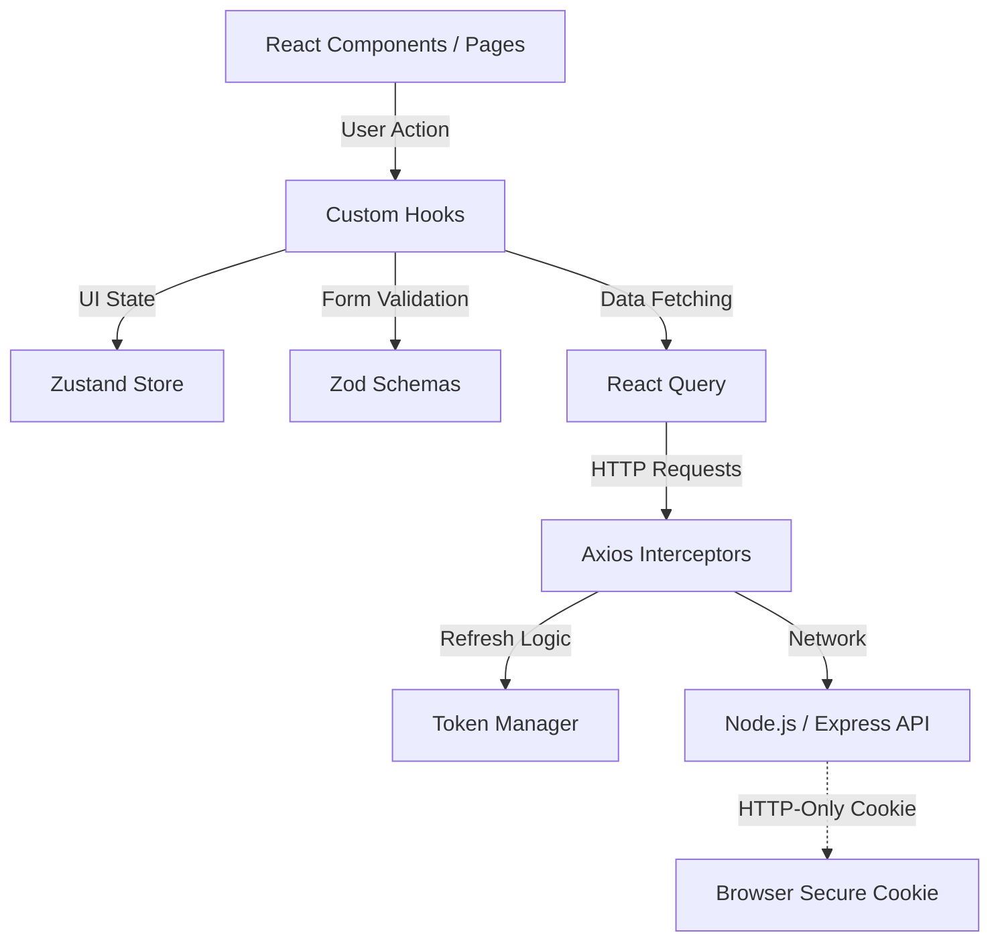
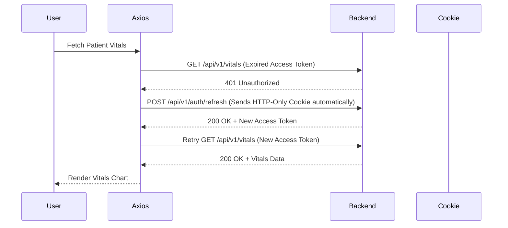
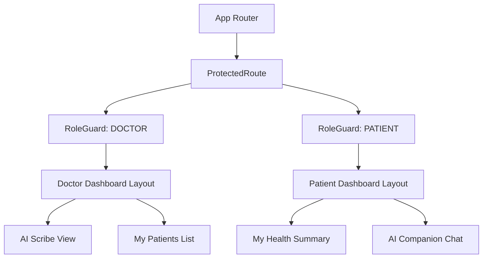

# 🏗️ Frontend Architecture Overview (React SPA)

This document outlines the folder structure, component hierarchy, data flow, and core infrastructure for the CareSync frontend application, built as a Single Page Application (SPA) using React, Vite, and modern web technologies.

## 🚀 External Tech Stack & Core Libraries
A quick-reference guide to the primary libraries and services utilized in the CareSync frontend:

*   **Core Framework & Build Tool**
    *   **React 18/19**: Core UI library.
    *   **Vite**: Extremely fast build tool and development server.
    *   **React Router DOM**: Client-side routing with role-based access control (RBAC).
*   **State Management & Data Fetching**
    *   **Zustand**: Lightweight global state management (UI state, auth state).
    *   **TanStack Query (React Query)**: Server state management, caching, and data synchronization.
    *   **Axios**: HTTP client with global interceptors for auth and error handling.
*   **UI & Styling**
    *   **Tailwind CSS**: Utility-first CSS framework for rapid, responsive UI development.
    *   **Radix UI / Shadcn UI**: Unstyled, accessible component primitives for building the design system.
    *   **Framer Motion**: Smooth micro-animations and page transitions for a premium feel.
*   **Forms & Validation**
    *   **React Hook Form**: Performant, flexible, and extensible form handling.
    *   **Zod**: TypeScript-first schema validation (sharing schemas with the backend).
*   **Media & Specialized Libraries**
    *   **React Media Recorder**: Handling microphone access and ambient audio recording for the AI scribe.
    *   **Socket.io-client** *(Future)*: For real-time chat and notifications.

## 📂 Folder Structure

```text
frontend/
├── public/               # Static assets (images, icons, manifest)
├── src/
│   ├── assets/           # Global styles (index.css) and local media
│   ├── components/       # Reusable UI components
│   │   ├── common/       # Buttons, Inputs, Modals, Loaders
│   │   └── layouts/      # DashboardLayout, AuthLayout, Navbar, Sidebar
│   ├── features/         # Feature-based modular code (Domain-Driven Design)
│   │   ├── auth/         # Login, Register, Auth forms
│   │   ├── scribe/       # Audio recording UI, transcript view, SOAP note display
│   │   ├── dashboard/    # Patient/Doctor overview widgets
│   │   ├── appointments/ # Calendar, booking flow
│   │   └── chat/         # AI Companion interface
│   ├── hooks/            # Custom React hooks (e.g., useAuth, useAudioRecorder)
│   ├── pages/            # Top-level route components mapping to URLs
│   ├── routes/           # Route definitions, ProtectedRoute, RoleGuard logic
│   ├── services/         # Axios API clients (e.g., api.js, authService.js)
│   ├── store/            # Zustand global stores (e.g., useAuthStore.js)
│   ├── utils/            # Helper functions (date formatting, text transformers)
│   ├── App.jsx           # Root component, Context Providers (QueryClient)
│   └── main.jsx          # React DOM entry point
├── .env                  # Environment variables (VITE_API_BASE_URL)
├── tailwind.config.js    # Tailwind theme and plugin configuration
└── package.json          # Dependencies and scripts
```

## 🔄 Program Flow (The Component Lifecycle)

1.  **User Interaction**: User clicks "Record" in the Scribe interface.
2.  **Component State (`features/scribe/`)**: Local state updates to show a recording animation. `react-media-recorder` captures the mic stream.
3.  **Data Submission**: User clicks "Stop & Process". Component triggers an API call via an Axios service wrapper.
4.  **Service Layer (`services/`)**: The Axios instance attaches the Access Token from memory (or triggers a refresh if expired) and sends the `multipart/form-data` payload.
5.  **Server State (`TanStack Query`)**: The mutation fires. Upon success, TanStack Query invalidates relevant cache keys (like `visits-list`) to trigger an automatic UI refresh.
6.  **Global State (`store/`)**: If the action affects global data (e.g., unread notifications count), the Zustand store is updated.
7.  **UI Update**: React re-renders the DOM efficiently with the new data, displaying the AI-generated SOAP note.

## 🏗️ Infrastructure Architecture

### Application Structure Strategy (Feature-Sliced Design)
*   **Feature-Based Folders**: Code is organized into domains (`features/auth`, `features/scribe`) rather than purely by file type. This keeps related components, hooks, and localized styles together, making the codebase highly scalable and easier to maintain as it grows.

### State Management Strategy
*   **Server State (React Query)**: Caches API responses, manages loading/error states, and handles background background updates (e.g., fetching the latest patient vitals). This drastically reduces redundant API calls.
*   **Client State (Zustand)**: Manages purely frontend state that doesn't belong in the database (e.g., `isSidebarOpen`, `currentAudioPlaybackTime`, `userRole`).
*   **App Load Rehydration**: On initial load, the frontend explicitly calls `authService.getMe()` (after refreshing the token) to rehydrate the user's role and profile. This ensures state isn't lost on page reloads.

### Routing & Role-Based Access Control (RBAC)
*   **Single Page Application (SPA)**: We use a unified SPA structure. Instead of separate apps for Doctors and Patients, we use **Role-Based Routing**.
*   **Guarded Routes**: A `<ProtectedRoute>` component wraps sensitive pages. It checks `isAuth`. A nested `<RoleGuard allowedRoles={['DOCTOR']}>` component strictly prevents patients from accessing doctor dashboards.

### API Integration & Interceptors
*   **Axios Interceptors**:
    *   **Request Interceptor**: Automatically attaches the `Authorization: Bearer <token>` to every request.
    *   **Response Interceptor**: Catches `401 Unauthorized` errors. If triggered, it seamlessly calls the `/api/v1/auth/refresh` endpoint (which relies on the HTTP-only refresh cookie) to get a new access token, then transparently retries the failed request. If the refresh fails, the user is forcefully logged out.

### Error Handling & Validation
*   **Client-Side Validation**: All forms use `react-hook-form` coupled with **Zod** schema resolvers. This ensures users cannot submit malformed data (like missing allergens) before it even reaches the network.
*   **Global Error Boundary**: A top-level React Error Boundary catches fatal rendering crashes and displays a fallback "Something went wrong" UI instead of a blank white screen.
*   **Toast Notifications**: Non-fatal API errors (e.g., "AI processing timed out") trigger standardized toast notifications via a library like `react-hot-toast` or `sonner`.

### Styling & Theme Architecture
*   **Utility-First CSS**: Tailwind CSS ensures highly consistent styling. We strictly define a custom color palette (e.g., `primary-blue`, `clinical-white`) in `tailwind.config.js`.
*   **Dark Mode**: Supported natively via Tailwind's `dark:` modifier, toggleable via a Zustand global state.
*   **Component Primitives**: Complex accessible components (Dialogs, Select menus) are built using Shadcn UI / Radix to ensure WAI-ARIA compliance (crucial for healthcare accessibility).

---

# 🧠 Architecture Reasoning (The "Why")

## 1. SPA vs. Multi-App Reasoning

### Why use a Single Page Application (SPA) for all roles instead of separate `/doctor` and `/patient` apps?
*   **Reason**: High code reuse. A massive portion of the UI (modals, buttons, profile settings, chat interfaces, notification panels) is identical across roles. Maintaining separate repositories or Vite apps doubles the maintenance burden. By using strict conditional rendering and role-guards, we keep the deployment simple while strictly siloing views.

## 2. State Management Reasoning

### Why separate Server State (React Query) from Global State (Zustand)?
*   **Reason**: In legacy React apps, Redux was used to store API responses. This led to massive boilerplate and manually writing `IS_LOADING`, `IS_SUCCESS`, `IS_ERROR` actions. React Query automates caching, garbage collection, and loading states for APIs out-of-the-box. Zustand is kept purely for lightweight UI toggles, keeping the architecture extremely clean.

## 3. Security Reasoning

### Why store the Access Token in memory instead of `localStorage`?
*   **Reason**: Storing JWTs in `localStorage` makes them highly vulnerable to Cross-Site Scripting (XSS) attacks. If a malicious script runs, it can read `localStorage`. By keeping the short-lived access token in memory (Zustand/Context) and relying on the backend's Secure, HTTP-Only cookie for the refresh token, we drastically reduce the attack surface.

## 4. Audio Processing Reasoning

### Why process audio purely via `multipart/form-data` REST APIs instead of WebSockets?
*   **Reason**: While WebSockets allow live streaming, they introduce immense frontend complexity (reconnection logic, buffering, state syncing). For an MVP medical scribe, a "Record -> Stop -> Upload -> Wait for JSON" flow via REST is highly reliable, significantly easier to debug, and perfectly matches the backend architecture.

---

# 📊 Architecture Diagrams

## 1. Frontend System Architecture


## 2. Authentication & Refresh Flow (Interceptor Logic)


## 3. Role-Based Component Hierarchy


---

# 🌐 Routing & Views Strategy

This application utilizes React Router DOM. Below is the primary routing table, demonstrating how we silo users based on their `Role` enum (`PATIENT`, `DOCTOR`, `ADMIN`).

| Route Path | Associated Component | Required Role | Purpose |
| :--- | :--- | :--- | :--- |
| **Public Routes** | | | |
| `/` | `LandingPage` | `ANY` | Marketing landing page. |
| `/login` | `LoginPage` | `GUEST` | Authentication portal. |
| `/register` | `RegisterPage` | `GUEST` | Account creation. |
| **Patient Routes** | | | |
| `/dashboard` | `PatientDashboard` | `PATIENT` | High-level summary, next appointments. |
| `/health/vitals` | `VitalsView` | `PATIENT` | Charts showing BP, Heart Rate history. |
| `/health/prescriptions`| `PrescriptionList`| `PATIENT` | Active meds, simplified AI instructions. |
| `/chat` | `CompanionChat` | `PATIENT` | Interface to ask AI health questions. |
| `/reports/new` | `SubmitReport` | `PATIENT` | Form to submit symptom updates (requires selecting a `doctorId`). |
| **Doctor Routes** | | | |
| `/provider/dashboard` | `DoctorDashboard` | `DOCTOR` | Daily schedule, pending patient reports. |
| `/provider/patients` | `PatientDirectory`| `DOCTOR` | Search and filter assigned patients (calls a doctor-specific users route). |
| `/provider/patients/:id`| `PatientDetail` | `DOCTOR` | Comprehensive medical history view. |
| `/provider/scribe/:patientId` | `ScribeConsole` | `DOCTOR` | Core AI Scribe & recording interface. |
| `/provider/calendar` | `DoctorCalendar` | `DOCTOR` | Manage appointment slots. |
| `/provider/reports` | `DoctorReports` | `DOCTOR` | Review pending patient symptom updates. |

> [!IMPORTANT]
> A patient navigating to `/provider/dashboard` will be caught by the `<RoleGuard>` and seamlessly redirected to their `/dashboard` or a `403 Forbidden` page.

---

# ⚙️ Core Services & Hooks

This layer abstracts API complexity away from the UI components.

## API Services (`services/`)
Instead of calling `axios.get` directly inside components, we define strict service wrappers matching the backend structure:
*   **`authService.js`**: `login()`, `register()`, `logout()`, `getMe()` (called on app load for user rehydration)
*   **`scribeService.js`**: `uploadAudio(file, patientId)`, `getPatientVisits(patientId)`, `getVisitDetail(visitId)`
*   **`vitalsService.js`**: `recordVitals(data)`, `getVitalsHistory(patientId)`
*   **`prescriptionService.js`**: `getPatientPrescriptions(patientId)`, `createPrescription(data)` (Note: `visitId` is strictly required in the data payload)
*   **`appointmentService.js`**: `scheduleAppointment(data)`, `getAppointments()`, `getPreVisitBrief(id)`, `updateAppointment(id, data)`
*   **`notificationService.js`**: `getNotifications()`, `markAsRead(id)`
*   **`reportService.js`**: `submitPatientReport(data)` (requires `doctorId`), `reviewPatientReport(id)`

## Custom Hooks (`hooks/`)
*   **`useAuth.js`**: Wraps Zustand auth state, providing `user`, `login`, `logout`, and `isLoading` flags to components.
*   **`useAudioRecorder.js`**: Abstracts the MediaRecorder API. Handles requesting microphone permissions, starting/stopping, visualizing audio waves (optional), and returning the final `Blob`.
*   **`useScribeMutation.js`**: A React Query hook wrapping `scribeService.uploadAudio`. It manages the `isPending` state while the backend calls Gemini/DeepSeek, and invalidates the patient history cache upon success.

---

# 🔒 Security Architecture (Frontend)

## 1. Cross-Site Scripting (XSS) Prevention
*   React automatically escapes all string variables in JSX, preventing basic XSS.
*   We strictly avoid using `dangerouslySetInnerHTML`. If rendering rich text (like formatted AI responses), we use a secure Markdown parser (e.g., `react-markdown`) configured to sanitize HTML tags.

## 2. File Upload Security
*   The frontend enforces validation *before* upload to save bandwidth. The `FileInput` component restricts selections to `audio/*` and checks file size (e.g., `< 25MB`) before allowing the Axios request to fire.

## 3. Data Privacy in UI
*   Sensitive data (like passwords) is never temporarily stored in global states or `localStorage`. It is only handled in local component state during form submission and immediately cleared.
*   PHI (Protected Health Information) fetched via React Query is purged from memory automatically when the user logs out (by calling `queryClient.clear()`).

---

# 🌟 AI Medical Scribe Interface & Audio Flow

## 📌 Feature Implementation on Frontend

The Scribe Console (`/provider/scribe/:patientId`) is the most complex UI in the application.

### UI Layout
1.  **Patient Context Sidebar**: Shows the patient's active allergies, past medical history, and previous visit date. (Fetched via React Query).
2.  **Recording Dashboard**:
    *   **Microphone Button**: Starts/Stops recording.
    *   **Timer**: Displays elapsed recording time.
    *   **Pulsing Animation**: Visual feedback indicating the mic is active (using Framer Motion).
3.  **Output Console (Split View)**:
    *   *Left Side*: Displays the Raw Transcript (once processed).
    *   *Right Side*: Displays the structured SOAP Note returned by the AI.

### The Audio Flow
1.  **Permission**: User clicks "Record". `navigator.mediaDevices.getUserMedia({ audio: true })` is called.
2.  **Capture**: Audio chunks are collected by the MediaRecorder.
3.  **Completion**: User clicks "Stop". Chunks are assembled into a `.wav` or `.webm` Blob.
4.  **Submission**:
    ```javascript
    const formData = new FormData();
    formData.append("audio", audioBlob, "visit_recording.wav");
    formData.append("patientId", currentPatientId);
    
    // TanStack Query Mutation
    uploadScribeAudio.mutate(formData);
    ```
5.  **Loading State**: UI displays a "Transcribing and Analyzing Session..." skeleton loader.
6.  **Resolution**: The JSON payload (containing `subjective`, `objective`, `assessment`, `plan`, `prescriptions`) is injected directly into editable form fields. The doctor can review and modify the AI's output before hitting "Finalize & Save".

## ✅ Fallback & Error States
*   **Mic Denied**: If the user blocks microphone access, the UI switches to a manual text-entry mode ("Type your notes manually or enable microphone permissions in browser settings").
*   **AI Timeout**: If the backend takes longer than 30 seconds (due to LLM delays), the frontend displays a localized warning toast and allows the user to manually retry the submission using the already-captured audio blob (stored temporarily in component state).
