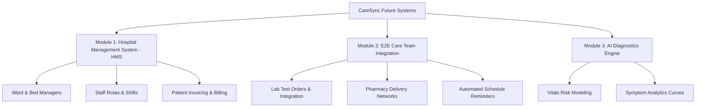

# CareSync: Product Ecosystem & Design Blueprint Manual

This specification manual defines the functional architecture, page layouts, user flows, and upcoming features of the CareSync platform. It is designed to serve as a comprehensive blueprint for UI/UX designers, brand strategists, and marketing illustrators to create the visual identity, landing pages, and component libraries. All color, typography, and stylistic choices are left to the designer's creative direction.

---

## 1. Product Brand & Asset Requirements

The designer has full creative liberty to define the brand's visual system, including color palettes, typography, iconography style, and imagery. The design should convey trust, intelligence, medical reliability, and technological innovation.

### Required Brand Assets:
1. **Logo Suite**:
   - Standard horizontal logo (Logotype + Icon) for navigation headers.
   - Square/stacked logo variant for mobile headers, footers, and app icons.
   - Standalone icon/symbol (Favicon and avatar placeholders).
   - High-contrast monochrome variants (light and dark mode compatibility).
2. **Interface Component Kit**:
   - Unified button states (Default, Hover, Active, Disabled, Loading).
   - Text inputs, labels, and validation states (Success, Error).
   - Custom select dropdowns (with support for multi-language selections and script switching).
   - Modals and Overlays (detailing headers, scrollable body containers, close buttons, and footers).
   - Navigation sidebars and top bars for Role-Based Access Control.
3. **Data Visualization Assets**:
   - Multi-metric Line Chart layout styling (Axis lines, Grid lines, Hover tooltips, and legends).
   - Data summary cards featuring vital metrics.
4. **Marketing & Illustration Assets**:
   - Icon library for medical specialties, clinical terminology guide, prescriptions, and transcription tools.
   - Custom illustrations representing AI speech processing and language translation.

---

## 2. Page-by-Page Feature Specifications

### A. Authentication & Onboarding
*   **Sign In / Registration Screen**:
    *   *Features*: Standard fields (Name, Email, Password, Date of Birth).
    *   *Role Selector*: Explicit options to toggle between **Patient** and **Healthcare Provider**.
    *   *User Flow*: After successful authentication, the system reads the role claim from the secure token and routes the user to the corresponding dashboard.

### B. Patient Dashboard
*   **Overview Panel**:
    *   *Quick Vitals Summary*: Cards displaying latest Heart Rate, Blood Pressure, Weight, and Temperature.
    *   *Recent Care Overview*: Quick links to active prescriptions, upcoming appointments, and recent visit summaries.
*   **Vitals Tracking Page**:
    *   *Chart View*: A unified interactive chart containing historical plots for Heart Rate, Blood Pressure (Systolic and Diastolic), Weight, and Temperature on a single chronological timeline.
    *   *Add Reading Modal*: A form allowing patients to manually log new vitals (fields for heart rate, blood pressure format, weight, and temperature).
*   **Visits History & Consultation Instructions Modal**:
    *   *Interactive Selector*: Dropdown menu to translate the clinical notes (Urdu, Hindi, Arabic, Spanish, etc.).
    *   *Translation State*: A loading indicator with micro-animations displayed during translation requests.
    *   *Diagnosis & Assessment (Subjective)*: Rendered block displaying doctor diagnoses.
    *   *Doctor's Plan (Objective)*: Step-by-step patient plan and lifestyle instructions.
    *   *Prescribed Medications Grid*: Individual cards for each medicine showing:
        *   Medicine name, dosage, frequency, and duration.
        *   An AI-simplified translation block providing layperson instructions.
    *   *Terminology Dictionary*: Explanatory cards showing complex medical jargon matched with simplified definitions.
    *   *Detailed Consult Logs*: Expandable panels showing subjective (symptoms, complaints) and objective (vitals, exam findings) raw notes generated by the Scribe.
*   **Secure Patient Chat**:
    *   *Features*: Real-time message exchange window with active indicators and profile badges.

### C. Provider (Doctor) Portal
*   **Doctor Dashboard**:
    *   *Daily Schedule*: Chronological list of confirmed appointments, complete with patient profile links.
    *   *Pending Tasks*: Review notifications for newly submitted patient reports.
*   **Patient Directory**:
    *   *Features*: Searchable, paginated table listing patients with demographic summaries.
    *   *Prescription Creator*: An overlay modal containing form fields for:
        *   Medicine Name, Dosage (e.g. 500mg), Frequency (e.g. Once daily), and Duration (e.g. 7 days).
        *   Clinical notes section.
*   **Scribe Console (AI Encounter Transcription)**:
    *   *Audio Control Panel*: A start/stop microphone interface.
    *   *Live Transcription Feed*: A real-time scrolling console showing live Web Speech captions as dialogue occurs.
    *   *Audio Player*: Playback widget to review the recorded consultation audio.
    *   *Notes Review Board*: Side-by-side columns presenting the AI-generated SOAP notes (Subjective, Objective, Assessment, Plan) and the extracted medical terminology dictionary before finalizing the record.
*   **Doctor Reports Review Page**:
    *   *List View*: Directory of reports sent by patients.
    *   *Review Flow*: Actionable detail modal showing patient symptoms, severity flags, and notes, with a toggle or button to mark the report as "Reviewed" (triggering a state update on the backend).

---

## 3. Future Upcoming Systems

The landing page and branding elements must allocate visual areas (feature highlights, illustrations, or system cards) for three upcoming system modules:

### Module 1: End-to-End Hospital Management System (HMS)
*   **Visual Scope**:
    *   *Capacity Allocation*: Grid showing ward occupancies and bed assignments.
    *   *Staff Rosters*: Calendars and scheduling sheets for shift handovers.
    *   *Operations Billing*: Automated invoicing panels merging doctor fees, drug prescriptions, and stay duration costs.

### Module 2: E2E Care Team Integration
*   **Visual Scope**:
    *   *Laboratory Loop*: Interface tracking diagnostic test orders from request to results upload.
    *   *Pharmacy Delivery Tracker*: Status timeline showing fulfillment and dispatch of medications.
    *   *Medication Reminders*: Schedule trackers showing automated SMS/Email reminders triggered for patients.

### Module 3: AI Diagnostics & Clinical Analytics Engine
*   **Visual Scope**:
    *   *Symptom Progression Curves*: Analytical line and bar charts tracking recovery trends.
    *   *Vital Risk Alert Panels*: Real-time alarm banners indicating abnormal patient metrics.

---

## 4. Landing Page Structure (Information Hierarchy)

The designer must arrange the landing page using the following blueprint:

1.  **Hero Section**:
    *   *Concept*: Clear demonstration of CareSync's primary value proposition.
    *   *Content*: Engaging headline, call-to-action buttons (Doctor vs. Patient entry points), and a high-fidelity visual mock-up showing the Scribe Console (audio processing) on one side and translated patient-friendly instructions on the other.
2.  **Interactive Showcase**:
    *   *Concept*: Displaying clinical ease-of-use.
    *   *Content*: A visual presentation of the multi-metric vitals history line chart and translation dropdown interface in action.
3.  **Core Pillars Grid**:
    *   *Concept*: Current feature highlights.
    *   *Content*: Highlight cards detailing:
        *   *AI Encounter Scribe*: Automatic transcription to SOAP notes.
        *   *Multilingual Accessibility*: Instant translation and RTL adjustments.
        *   *Role-based Security*: JWT authorization and encrypted patient profiles.
4.  **Future Horizon (System Roadmap)**:
    *   *Concept*: Upcoming capabilities.
    *   *Content*: Interactive timeline cards detailing the **Hospital Management System (HMS)**, **E2E Care Team Loop**, and **AI Trend Analytics**.
5.  **Platform Security & Trust**:
    *   *Concept*: Compliance and data protection.
    *   *Content*: Visual representation of auditing, encryption, and medical data safety.
6.  **Footer CTA**:
    *   *Content*: Final sign-up forms and secondary navigation links.
